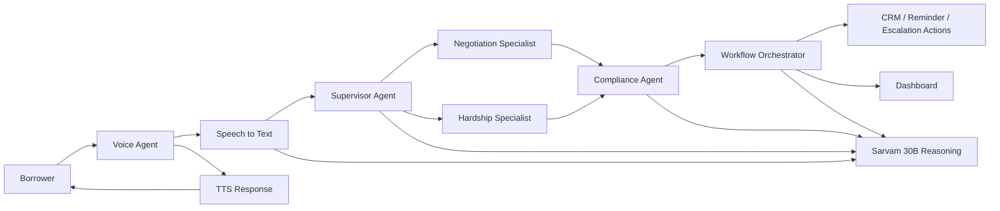

# Sarvam Live Collections Agent

A multilingual, compliance-aware collections copilot that combines Sarvam AI voice capabilities, Google ADK agent orchestration, and a Streamlit dashboard to simulate an empathetic borrower outreach workflow for Indian loan collections.

## Overview

Collections teams need to recover overdue payments while staying compliant, respectful, and practical. This project demonstrates a production-style agent workflow that can:

- greet borrowers in multiple Indian languages,
- understand whether the borrower is willing to pay, needs hardship support, or disputes the loan,
- route the conversation to the right specialist agent,
- run compliance checks before any downstream action,
- capture promise-to-pay outcomes and surface them in a dashboard.

The experience is designed to be demo-friendly and submission-ready, with a clear voice interface, a modular agent architecture, and a simple local setup.

## What this solution does

- Voice-first borrower interaction powered by Sarvam STT and TTS
- Multilingual support for Hindi, Hinglish, English, Tamil, Kannada, and Marathi
- Supervisor-driven routing between negotiation and hardship workflows
- Compliance specialist to flag risky or non-compliant behavior
- Workflow orchestration for promise-to-pay, escalation, and restructure flows
- Admin dashboard for monitoring calls, promises, escalations, and case outcomes

## Architecture

The repository is organized into three main layers:

1. Voice experience
   - The voice experience lives in the voice_agent module.
   - It handles greeting, user audio capture, transcription, agent speech, and conversational turn flow.

2. Agent orchestration
   - The adk_workflow package contains the Google ADK-based workflow.
   - A supervisor chooses whether the next step should go to negotiation or hardship handling.
   - A compliance agent evaluates whether the conversation is safe and compliant.
   - The workflow then decides whether CRM-like actions should be triggered.

3. Dashboard
   - The dashboard module provides a lightweight monitoring and demo interface.
   - It displays borrower context, call activity, promise-to-pay outcomes, escalations, and workflow summaries.

### Architecture diagram



## Project structure

- adk_workflow/ - supervisor, specialists, Sarvam client helpers, and workflow orchestration
- voice_agent/ - conversational UI and voice interaction flow
- dashboard/ - Streamlit-based monitoring dashboard
- docs/ - supporting documentation and notes

## Key features

- Multilingual and borrower-friendly communication
- Compliance guardrails for collections conversations
- Structured routing between business specialists
- Deterministic final-state handling for promise-to-pay and escalation outcomes
- Clean demo flow for live or recorded sessions

## Prerequisites

- Python 3.10+
- pip
- A valid Sarvam AI API key for live voice and reasoning features

## Setup

Create and activate a virtual environment:

```bash
python3 -m venv .venv
source .venv/bin/activate
```

Install the project dependencies:

```bash
pip install -r requirements.txt
```

Set your Sarvam API key:

```bash
export SARVAM_API_KEY="your_sarvam_api_key"
```

If you want Streamlit to use the same key automatically, create a secrets file:

```bash
mkdir -p .streamlit
cat > .streamlit/secrets.toml <<'EOF'
[SARVAM_API_KEY]
value = "your_sarvam_api_key"
EOF
```

## Run locally

Start the voice agent experience:

```bash
streamlit run voice_agent/agent.py
```

Start the monitoring dashboard:

```bash
streamlit run dashboard/app.py
```

## Demo flow

1. Launch the voice agent.
2. Choose a borrower profile and language.
3. The system greets the borrower and begins the collections conversation.
4. The supervisor routes the conversation to negotiation or hardship support.
5. Compliance checks run before any final outcome is processed.
6. The dashboard displays the resulting summary, reminders, escalations, and promise-to-pay events.

## Submission notes

This project is positioned as a practical AI-native collections assistant that balances:

- collection efficiency,
- customer empathy,
- compliance discipline,
- and explainable workflow orchestration.

It is especially suitable for a demo or evaluation because it shows a complete end-to-end flow rather than a single isolated LLM prompt.

## Notes for reviewers

- The solution uses mock borrower profiles for demo clarity.
- Full live voice execution requires a valid Sarvam API key.
- The workflow is modular, so the same orchestration layer can later be connected to real CRM systems, telephony providers, or internal policy engines.

## Future extensions

- Real CRM integration and case management hooks
- Call analytics and sentiment review
- Human handoff workflows for high-risk accounts
- Enhanced multilingual quality tuning and domain-specific prompts
